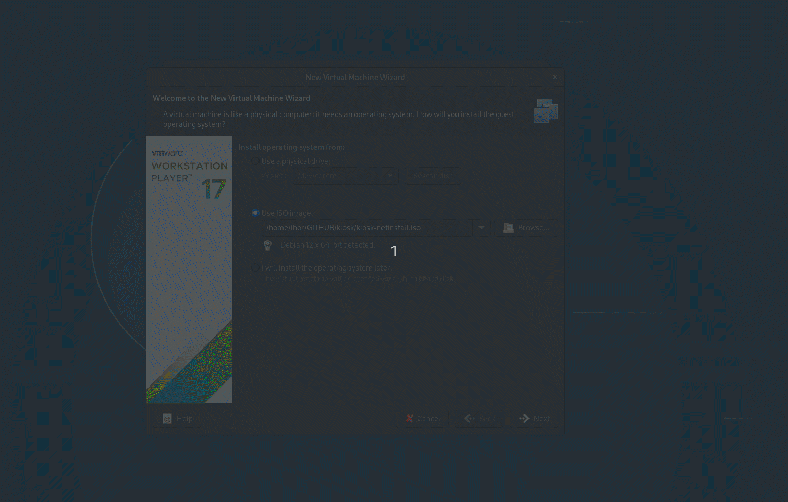

# KIOSK

debian-based kiosk distro

### License

[](https://opensource.org/licenses/)


## Features and benefits

- Easy configure && create custom ISO 
- Automated installation
- Debian12 based
- **Support WEBGL** 
- ssh included (default root pass *changeme*)
## FUTURE
- *Openvpn\wireguard* clients will be added for the possibility of remote control of the kiosk
- Recognition and identification of each kiosk will be added for the convenience of remote management
## Installation

- clone repository
- make sure that you modify **./SCRIPTS/preseed/preseed.cfg** as your neeed
- make sure that you modify  **./SCRIPTS/preseed/postinst.sh** as your need 
    - in line of  **./SCRIPTS/preseed/postinst.sh** 41 set your url to show in kiosk
    - in line 6 **./SCRIPTS/preseed/postinst.sh** modify value *custom_port* it is port for ssh
- make sure that in project dir you have correct base distro
- run the command below (create kiosk without cursor only for TOUCHSCREENS)
```bash
sudo ./create 
```
- run the command below (create kiosk with cursor)
```bash
sudo ./create cursor
```
Now you can burn the received iso to the drive using such tools as:
- dd https://man7.org/linux/man-pages/man1/dd.1.html
- Rufus https://rufus.ie
- balenaEtcher https://etcher.balena.io/

## DEMO OF INSTALLING



### Authors

- [@dzhunli](https://github.com/dzhunli)


### Documentation

[Debian pressed](https://www.debian.org/releases/stable/s390x/apbs02.en.html)

[WEBGL on linux](https://forum.onshape.com/discussion/19653/chrome-linux-webgl)

## Acknowledgements

Special thanks to Luc Didry for his preseed.sh the script for adding preseed.cfg to the ISO.

